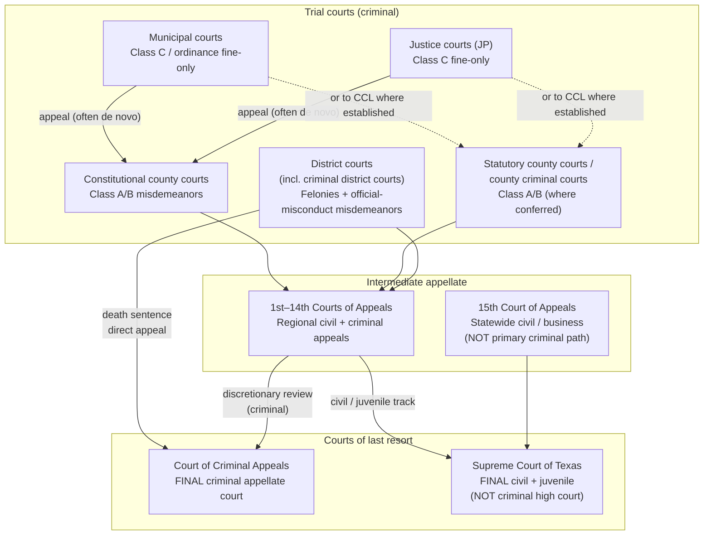

# Texas Criminal Courts — Structure & Public Data-Serving Inventory

**Audience:** Charlie (CTO) → Prasanth  
**Purpose:** Inventory of Texas criminal court **layouts** and how each layer **serves** case/party/disposition data to the public.  
**Not in scope:** Product strategy, Bronze/Silver load recommendations, MVP build order, vendor negotiation playbooks, builder handoffs.  
**Research date:** 2026-09-17 (America/Chicago)  
**Method:** Lawful/official primary sources only (OCA, txcourts.gov, statutes, published clerk portals). No scraping, CAPTCHA bypass, or live case-search harvests.  
**Disclaimer:** Not legal advice. Access descriptions reflect published serving methods; sealed/confidential/expunged records are excluded from public channels by definition.

**ADR:** Deferred — inventory only.

---

## 1. Court structure (criminal path)

### 1.1 Diagram (criminal appellate path)



ASCII fallback:

```
Municipal / JP (Class C fine-only)
        |  appeal (often trial de novo; on-record if municipal court of record)
        v
Constitutional county court  OR  statutory county court / county criminal court
        |  (Class A/B misdemeanors; appellate from lower courts)
        v
District court / criminal district court  ----(death sentence)---->  Court of Criminal Appeals
        |                                                              ^
        | intermediate appeal (non-death)                              |
        v                                                              |
1st–14th Courts of Appeals  -------- discretionary review -------------+
        
Supreme Court of Texas = civil + juvenile last resort (NOT criminal)
15th Court of Appeals = statewide civil/business intermediate (NOT criminal path)
```

### 1.2 Narrative

Texas splits courts of last resort by subject matter (Tex. Const. art. V; OCA *Court Structure of Texas*, September 2026):

| Court | Final jurisdiction |
| --- | --- |
| **Court of Criminal Appeals (CCA)** | Final appellate jurisdiction in **criminal** cases. Death sentences appeal **directly** to the CCA. The CCA may review criminal decisions of the courts of appeals. |
| **Supreme Court of Texas** | Final appellate jurisdiction in **civil** and **juvenile** cases. It is **not** the criminal high court. Juvenile delinquency matters remain on the civil/juvenile track unless certified/transferred to adult criminal court. |

**Trial → intermediate → CCA (criminal):** Felony and most appealable misdemeanor criminal judgments go from district / county-level trial courts to the regional **1st–14th Courts of Appeals**, then (if review is granted) to the **CCA**. Death sentences bypass the intermediate courts and go straight to the CCA.

**15th Court of Appeals:** Statewide intermediate court with civil/business and certain state-entity appellate jurisdiction. It is **not** the ordinary criminal intermediate path (OCA Sept 2026 chart).

**Specialty criminal programs** (drug courts, veterans courts, DWI courts, etc.): Authorized by statute (e.g., Gov’t Code ch. 123 for drug court programs) and typically administered by referral from an existing district or statutory county court. They do **not** create a separate statewide court type or statewide public data portal; records remain with the referring court’s clerk CMS.

### 1.3 Primary structure citations

- OCA court structure chart (Sept 2026): https://txcourts.gov/media/1463290/court-structure-chart-sept-2026.pdf  
- Texas Judicial Branch — Trial Courts: https://www.txcourts.gov/about-texas-courts/trial-courts/  
- Code of Criminal Procedure ch. 4 (jurisdiction): arts. 4.01, 4.04, 4.05, 4.07, 4.11, 4.14 — https://statutes.capitol.texas.gov/  
- Texas Constitution art. V (Judicial Department): https://statutes.capitol.texas.gov/Docs/CN/htm/CN.5.htm  

---

## 2. Inventory of court types that hold criminal data

Counts below are from the **OCA Court Structure of Texas — September 2026** chart unless noted. Geography: **254 counties**.

### 2.1 Mapping across 254 counties (what every county has vs metro variants)

| Layer | Every county? | Metro / large-county variants |
| --- | --- | --- |
| Connection to at least one **district court** | Yes (constitutional requirement that each county be served by ≥1 district court) | Sparse counties share multi-county districts; large counties host many district courts, some labeled criminal/family/etc. |
| **Constitutional county court** | Yes — 1 per county (254) | In populous counties the county judge may focus on county administration; judicial misdemeanor load often shifts to statutory county courts |
| **Statutory county court / CCL / county criminal court** | No — only where legislature created them | 262 courts in 92 counties + 2 multi-county courts covering 6 counties |
| **Justice court (JP)** | Yes — each county must establish 1–8 JP precincts (population-driven) | Large counties have many JP courts; precinct geography is local |
| **Municipal court** | Only in incorporated cities | Large cities run multiple municipal courts; 224 municipal courts of record (Sept 2026 list on txcourts.gov) |
| **Courts of Appeals (1st–14th)** | Every county sits in one regional district | District map is legislative; not one-per-county |
| **CCA / Supreme Court** | Statewide | Single courts in Austin |

### 2.2 District courts (incl. criminal district courts)

| Attribute | Detail |
| --- | --- |
| **Count (Sept 2026)** | **517** courts / **517** judges; **419** one-county districts; **98** multi-county districts |
| **Criminal jurisdiction** | Original jurisdiction in **felony** criminal cases; misdemeanors involving **official misconduct**; misdemeanors transferred under CCP art. 4.17 (CCP art. 4.05) |
| **Named criminal district courts** | **13** district courts are designated criminal district courts; other district courts may be directed to give preference to specialized areas (OCA chart) |
| **Record holder** | Typically the **district clerk** of the county where the case is filed |
| **254-county mapping** | Every county is served by ≥1 district court; urban counties (Harris, Dallas, etc.) have many numbered district courts, some exclusively or primarily criminal |

### 2.3 Constitutional county courts

| Attribute | Detail |
| --- | --- |
| **Count** | **254** (exactly one per county) |
| **Criminal jurisdiction** | Exclusive original jurisdiction over misdemeanors with fine **> $500** or a **jail** sentence (Class A/B band), subject to JP exclusive Class C territory (CCP art. 4.07; OCA chart). Appellate jurisdiction from JP/municipal (de novo, or on the record from municipal courts of record) |
| **Record holder** | Typically the **county clerk** |
| **Practice note** | In large counties, the constitutional county court may handle little or no criminal trial volume; statutory county courts absorb it |

### 2.4 County courts at law / county criminal courts (statutory county courts)

| Attribute | Detail |
| --- | --- |
| **Count** | **262** statutory county courts in **92** counties, plus **2** multi-county courts covering **6** counties |
| **Criminal jurisdiction** | All civil, criminal, original, and appellate actions prescribed by law for constitutional county courts, **as conferred by the creating statute** (varies by court). Many metro counties operate **county criminal courts** or CCLs with explicit Class A/B criminal dockets |
| **Record holder** | Typically the **county clerk** (local statutes/practice can vary) |
| **Not every county** | Rural counties without statutory county courts rely on the constitutional county court (and district court for felonies) |

### 2.5 Justice courts (JP)

| Attribute | Detail |
| --- | --- |
| **Count** | **798** courts / **799** judges |
| **Criminal jurisdiction** | Class C misdemeanors punishable by **fine only** (no confinement); magistrate functions (warrants, etc.) |
| **Courts of record?** | **All justice courts are not courts of record**; appeals are generally by **trial de novo** in county-level courts (OCA chart footnote) |
| **Record holder** | Justice of the peace / JP clerk for that precinct — **local systems**, not district/county clerk CMS in most places |
| **Every county** | Yes (1–8 precincts per county by population rules) |

### 2.6 Municipal courts

| Attribute | Detail |
| --- | --- |
| **Count** | **954** courts / **1,241** judges |
| **Criminal jurisdiction** | Class C misdemeanors punishable by fine only; **exclusive** original jurisdiction over municipal ordinance criminal cases within city limits; concurrent with JP for many state-law Class C offenses inside city limits |
| **Courts of record?** | Most are **not** courts of record; as of Sept 2026, **224** indicated they are courts of record (list posted on txcourts.gov) |
| **Record holder** | Municipal court clerk / city court administration |
| **Geography** | Only in incorporated municipalities — not a 254-county universal layer |

### 2.7 Specialty criminal courts (drug / veterans / DWI / etc.)

- Sit **inside** existing district or county-level dockets via referral/program assignment (Gov’t Code ch. 123 and related program chapters).  
- **No separate statewide count** of “specialty courts” as independent courts of record on the OCA structure chart.  
- **Data implication:** Public access follows the **host court clerk** (district or county clerk CMS / local portal), not a distinct specialty-court statewide feed.

### 2.8 Courts of Appeals (1st–14th) and 15th role

| Court | Count | Criminal role |
| --- | --- | --- |
| **1st–14th Courts of Appeals** | **14** courts / **80** justices | Regional intermediate appeals from trial courts in their districts — **includes criminal** appeals (non-death) |
| **15th Court of Appeals** | **1** court / **3** justices | Statewide **civil**/business and certain state-entity appeals; **not** the primary criminal intermediate court |

**Record / opinion access:** Appellate clerks + statewide **TAMES** case/opinion search (see §3). TAMES is **not** a trial-court warehouse.

### 2.9 Court of Criminal Appeals

| Attribute | Detail |
| --- | --- |
| **Count** | **1** court / **9** judges |
| **Jurisdiction** | Final appellate jurisdiction in **criminal** cases; direct appeals of death sentences; discretionary review of courts of appeals’ criminal decisions (Const. art. V; CCP art. 4.04) |
| **Data serving** | TAMES interactive search; opinions and appellate case metadata — not trial dockets |

### 2.10 Supreme Court of Texas (clarify: NOT criminal high court)

| Attribute | Detail |
| --- | --- |
| **Count** | **1** court / **9** justices |
| **Jurisdiction** | Final appellate jurisdiction in **civil** and **juvenile** cases |
| **Criminal data?** | **No** — does not sit as the criminal court of last resort. Listed here only to prevent conflation with the CCA |

---

## 3. How each court type / major public access system SERVES data

Serving methods used below:

| Label | Meaning |
| --- | --- |
| Interactive web search | Public (or registered) browser search of case indexes / ROA / limited docs |
| Clerk counter / paper | In-person or mail copies, certified records, desk search |
| Paid subscriber portal | County-published remote access under subscriber agreement / fee |
| Bulk dataset | Official downloadable flat files or published open datasets |
| API | Documented machine interface for third parties (rare/publicly absent for TX criminal trial data) |
| Statewide portal | Cross-county tool (criminal inclusion called out honestly) |
| None public | No published public electronic channel identified |

### 3.1 By court / clerk layer (trial)

| Court / custodian layer | Typical serving methods | Notes on criminal inclusion |
| --- | --- | --- |
| **District clerk** (felony / criminal district) | Interactive web (many large counties); clerk counter; occasional paid subscriber portal; **rare** published bulk datasets | Strongest published electronic criminal coverage among trial layers in metro counties; still **county-by-county**, not one statewide docket feed |
| **County clerk** (constitutional county / CCL / county criminal) | Interactive web (metro); clerk counter; sometimes same portal family as district (e.g., Odyssey public portals) | Class A/B misdemeanor custodian in most counties; often a **separate** office from district clerk |
| **JP courts** | Local interactive sites (uneven); clerk/precinct counter; paper | Fragmented; **not** in re:SearchTX; often non-record courts |
| **Municipal courts** | City portals or citation payment sites (uneven); municipal clerk counter | Ordinance + Class C; often absent from county district portals; often non-record |
| **Specialty dockets** | Same as host district/county clerk | No separate statewide serving channel identified |

### 3.2 Statewide tools as ACCESS CHANNELS only

#### A. re:SearchTX (`research.txcourts.gov`)

| Attribute | Published status |
| --- | --- |
| **What it is** | Statewide electronic court-records search companion to e-filing; marketed across **all 254 counties** for integrated CMS case types |
| **Serving method** | Interactive web search; paid document download; optional Pro/Premium subscriptions |
| **Criminal included?** | **No.** Official FAQ: *“At this time, re:SearchTX has all case types except for criminal.”* JP cases also **not** in re:SearchTX |
| **Bulk / API?** | No public REST bulk API documented for third-party consumers. ToS restrict scraping / automated bulk collection without prior Tyler approval |
| **Criminal roadmap signal (not public access today)** | OCA CASE NOTICES FAQ (updated 2026-07-10): criminal CASE NOTICES will flow **once** local criminal cases are integrated with re:SearchTX; FAQ still requires clerks to send **all criminal notices** outside re:SearchTX until then. That is clerk/attorney notice plumbing — **not** confirmation of public criminal search |
| **URLs** | https://research.txcourts.gov/ · FAQ: https://re-search.zendesk.com/hc/en-us/articles/360049547031-Who-Can-Access-re-SearchTX-and-What-Data-Can-They-See · OCA CASE NOTICES FAQ: https://www.txcourts.gov/media/1463049/faq-researchtx-case-notices.pdf |

#### B. OCA statistical / Court Activity Database (CARD) / data.texas.gov

| Attribute | Published status |
| --- | --- |
| **Serving method** | Statewide statistical portals + open-data downloads |
| **Criminal included?** | Yes as **aggregate caseload** (filings, dispositions, pending counts by county/court) — **not** party-level dockets |
| **URLs** | https://www.txcourts.gov/statistics/court-activity-database/ · example open data: https://data.texas.gov/dataset/Monthly-Criminal-Caseload-CY-2023-2026/hp5g-u8vi · annual reports: https://txcourts.gov/statistics/annual-statistical-reports/2025/ |

#### C. TAMES appellate search (`search.txcourts.gov`)

| Attribute | Published status |
| --- | --- |
| **Serving method** | Interactive web search of appellate cases/opinions (SCOTX, CCA, 1st–15th Courts of Appeals) |
| **Criminal included?** | Yes for **appellate** criminal matters (CCA + courts of appeals criminal track) |
| **Trial dockets?** | Explicit site disclaimer: *“This system does not maintain records on any trial court cases.”* |
| **Bulk / API?** | No public bulk trial feed; nightly refresh of appellate data |

#### D. eFile Texas

| Attribute | Published status |
| --- | --- |
| **Role** | Statewide **electronic filing** system (attorneys/filers), not a public criminal records warehouse |
| **Record access?** | Filing and service workflow; public case research is directed to re:SearchTX / local clerks — and re:SearchTX currently **excludes criminal** case types for public search |
| **URL** | https://efile.txcourts.gov/ (and Tyler-hosted eFileTexas landing pages) |

#### E. Court Analytics TX (CATX) — watch item only

- OCA contracted Tyler (2024) for a case-level statistical warehouse starting with criminal reporting for clerks.  
- **As of research date:** Documented as an OCA/clerk analytics and reporting replacement path — **not** published as a public commercial bulk/API access channel for outside consumers. Treat as **unclear / not public**.

### 3.3 Non-court statewide repository (optional footnote)

> **Footnote — DPS Crime Records (not a court):** The Department of Public Safety maintains a statewide criminal-history repository with a public conviction/deferred name-search channel under Gov’t Code §411.135 (interactive + batch credits). That is a **repository**, not a court docket serving system; Class C / municipal / JP matters often do not appear the way they do on local dockets. Secure Site CHRI is limited to legislatively authorized entities and is not a commercial dissemination path. Portal: https://crimerecords.dps.texas.gov/DpsWebsite/CriminalHistory

---

## 4. Per-layer access matrix (required)

| Court level | Criminal jurisdiction | Typical record holders (clerk/court) | Serving methods | Automation / bulk notes | Gaps |
| --- | --- | --- | --- | --- | --- |
| **Municipal courts** | Class C fine-only; exclusive municipal ordinance crimes | Municipal court clerk / city | Interactive (uneven); counter/paper; citation/payment sites | No statewide municipal criminal bulk; city systems vary | Non-record courts common; often missing from county portals; incomplete statewide visibility |
| **Justice courts (JP)** | Class C fine-only; magistrate functions | JP / precinct clerk | Local interactive (uneven); counter/paper | **Excluded from re:SearchTX**; no statewide JP criminal bulk identified | Non-record; 798-court fragmentation; appeals de novo reduce “official transcript” continuity |
| **Constitutional county courts** | Class A/B misdemeanors; appeals from JP/muni | County clerk | Interactive (some counties); counter/paper | Same county CMS story as CCLs where shared; no statewide criminal docket bulk | In metro counties judicial criminal load may be near-zero; rural electronic access often thin |
| **Statutory county courts / county criminal courts** | Class A/B where statute confers; appeals from lower courts | County clerk (typical) | Interactive web (metro Odyssey/etc.); counter; occasional subscriber | County-by-county; **not** in re:SearchTX criminal search today | Creating-statute variance; misdemeanor vs felony split across county vs district clerk |
| **District courts / criminal district courts** | Felonies; official-misconduct misdemeanors; transfers | District clerk | Interactive web (many metros); counter; paid subscriber (some); **published bulk datasets (rare, e.g. Harris)** | Official bulk exists in at least one large county; most counties interactive-only; anti-automation ToS common | No statewide criminal district bulk/API; sealed/juvenile/expunction handling local; multi-county districts complicate geography |
| **Specialty criminal programs** | Same as host court | Host district/county clerk | Same as host court | No separate specialty feed identified | Program labels may not appear cleanly in public indexes |
| **1st–14th Courts of Appeals** | Intermediate criminal (+ civil) appeals | Appellate clerk + TAMES | TAMES interactive; clerk counter for some materials | Appellate opinions/metadata — not trial party disposition warehouse | Not a substitute for trial criminal history |
| **15th Court of Appeals** | Civil/business intermediate (not criminal path) | Appellate clerk + TAMES | TAMES interactive | N/A for criminal trial inventory | Listed for structure clarity only |
| **Court of Criminal Appeals** | Final criminal appellate | CCA clerk + TAMES | TAMES interactive | Opinions / appellate case search | Not trial dockets |
| **Supreme Court of Texas** | Civil + juvenile final (NOT criminal) | SCOTX clerk + TAMES | TAMES interactive | N/A for adult criminal | Do not treat as criminal high court |
| **re:SearchTX (statewide portal)** | — (access channel) | Tyler / OCA program over local CMS integrations | Interactive web + paid docs + subscriptions | **Criminal case types excluded** (FAQ); JP excluded; no public bulk API | Criminal public search absent statewide via this channel |
| **OCA CARD / open statistical data** | Aggregate criminal caseloads | OCA | Statewide reports / open data downloads | Aggregate only — no defendant identity | Wrong grain for case/party inventory |
| **TAMES** | Appellate criminal + civil | OCA / appellate courts | Interactive web | Nightly refresh; no trial records | Trial disclaimer on site |
| **eFile Texas** | Filing channel | Statewide e-file | Filing/service (not public criminal warehouse) | Not a public criminal records API | Record access ≠ filing |

---

## 5. Sources (primary URLs)

### Structure & statutes
- https://txcourts.gov/media/1463290/court-structure-chart-sept-2026.pdf  
- https://www.txcourts.gov/about-texas-courts/trial-courts/  
- https://statutes.capitol.texas.gov/ (CCP ch. 4; Const. art. V; Gov’t Code ch. 123)  
- https://statutes.capitol.texas.gov/Docs/CN/htm/CN.5.htm  

### Statewide access channels
- https://research.txcourts.gov/  
- https://re-search.zendesk.com/hc/en-us/articles/360049547031-Who-Can-Access-re-SearchTX-and-What-Data-Can-They-See  
- https://www.txcourts.gov/media/1463049/faq-researchtx-case-notices.pdf  
- https://search.txcourts.gov/  
- https://www.txcourts.gov/statistics/court-activity-database/  
- https://data.texas.gov/dataset/Monthly-Criminal-Caseload-CY-2023-2026/hp5g-u8vi  
- https://txcourts.gov/statistics/annual-statistical-reports/2025/  
- https://efile.txcourts.gov/  

### Metro clerk examples (appendix)
- Harris Public Datasets: https://hcdistrictclerk.com/Common/e-services/PublicDatasets.aspx  
- Harris interactive search: https://www.hcdistrictclerk.com/eDocs/Public/search.aspx  
- Dallas District Clerk criminal records: https://www.dallascounty.org/government/district-clerk/records-criminal.php  
- Dallas PublicAccess: https://obpublicaccess24.dallascounty.org/PublicAccess/  
- Tarrant Web Based Access: https://www.tarrantcountytx.gov/en/district-clerk/services/web-based-access-service.html  
- Bexar Justice Information Portal / Odyssey: https://search.bexar.org/ (user guide: https://www.bexar.org/DocumentCenter/View/42706/Justice-Information-Portal---User-Guide-PDF)  
- Bexar District Clerk records: https://www.bexar.org/3703/Records  
- Travis District Clerk criminal division: https://www.traviscountytx.gov/district-clerk/criminal-division  
- Travis case information / Odyssey portal notes: https://www.traviscountytx.gov/district-clerk/case-information-records  

### Optional non-court footnote
- https://crimerecords.dps.texas.gov/DpsWebsite/CriminalHistory  

---

## Appendix A — Major metro examples ONLY

Published serving methods for five large counties. **No case pulls, no scrape notes, no CAPTCHA work.**

### Harris County

| Channel | Serving method |
| --- | --- |
| **District Clerk — Public Datasets** | Official **bulk** flat-file downloads (criminal filings, dispositions, historical extracts, layout/data-dictionary files). Portal explicitly points commercial/automated users to datasets instead of hammering interactive search. https://hcdistrictclerk.com/Common/e-services/PublicDatasets.aspx |
| **District Clerk — eDocs / Public Search** | Interactive web search (registration/login required for viewing); free public case info once logged in. Scope note on site: Harris only; **not** JP or municipal Class C. https://www.hcdistrictclerk.com/eDocs/Public/search.aspx |
| **Clerk counter** | In-person / mail copies via District Clerk |

**Custodian split:** District Clerk holds felony/district criminal; County Criminal Courts at Law / county clerk channels are separate for many misdemeanors — confirm at county clerk for Class A/B if not in district datasets.

### Dallas County

| Channel | Serving method |
| --- | --- |
| **District Clerk criminal records page** | Points public to online portal for felony/misdemeanor **case information** (back to 1975 stated) and felony documents (most post-2009); sealed/confidential excluded online. https://www.dallascounty.org/government/district-clerk/records-criminal.php |
| **PublicAccess portal** | Interactive web (Odyssey-style PublicAccess host). https://obpublicaccess24.dallascounty.org/PublicAccess/ |
| **Clerk counter / email copies** | Felony Records Desk; certified/copy requests; email intake for forms |
| **County Clerk** | Misdemeanor custodian contact called out separately from District Clerk on the criminal records page |

**Bulk dataset:** No Harris-style public criminal flat-file warehouse identified on the District Clerk pages reviewed for this inventory.

### Tarrant County

| Channel | Serving method |
| --- | --- |
| **District Clerk — Web Based Access Service** | **Paid subscriber** interactive remote access: district civil, family, felony, and misdemeanor court records + imaged documents. Published fees: $50 non-refundable setup; $35/mo for 1–5 users (see application for more users). https://www.tarrantcountytx.gov/en/district-clerk/services/web-based-access-service.html |
| **Subscriber agreement process** | Application + mailed agreement to District Clerk Office Manager |
| **Clerk counter** | Standard in-person/mail access |

**Bulk / API:** Not documented as a public bulk dump or open REST API on the service page — subscriber interactive access.

### Bexar County

| Channel | Serving method |
| --- | --- |
| **Justice Information Portal (Odyssey)** | Interactive public court-records search (name/case number; criminal hearing search). Registration **not** required for public access per county user guide. Portal consolidates prior Court Records Search at search.bexar.org. Guide: https://www.bexar.org/DocumentCenter/View/42706/Justice-Information-Portal---User-Guide-PDF |
| **District Clerk Records / Criminal Operations** | District Clerk is custodian for **felony** criminal records; counter/mail copies; published felony background-check service ($5, in person or mail). https://www.bexar.org/3703/Records · https://www.bexar.org/3700/Criminal |
| **County Clerk** | Misdemeanor / county-court records — separate from District Clerk felony custody |

**Bulk dataset:** No published countywide criminal flat-file bulk product identified in the official pages cited above.

### Travis County

| Channel | Serving method |
| --- | --- |
| **District Clerk — Odyssey Portal** | Interactive free online search; public register of actions. District Clerk materials state criminal coverage in the portal generally from **2008** forward (family/civil from 2006). https://www.traviscountytx.gov/district-clerk/case-information-records · criminal division: https://www.traviscountytx.gov/district-clerk/criminal-division |
| **Attorney / peace-officer elevated access** | Same portal family with registration for document viewing (role-based) |
| **Criminal Docket Search** | Separate public docket/settings search published at https://publiccourts.traviscountytx.gov/dsa |
| **Clerk counter / paid physical copies** | Felony records desk; records-request form for certified/physical copies |
| **County Clerk** | Misdemeanor records directed off District Clerk criminal division page |

**Bulk dataset:** Open-records / data / subscription requests are routed through a separate PIA-style intake (not a published self-serve criminal bulk FTP). Field-level continuous bulk licensing is **not** documented as a public product on the pages reviewed — treat as **unclear without clerk confirmation**.

---

## Appendix B — Document control

| Field | Value |
| --- | --- |
| Path | `docs/feasibility/TX-criminal-courts.md` |
| Companion exec summary | `docs/feasibility/TX-criminal-courts-exec-summary.md` |
| Prepared for | Charlie CTO → Prasanth |
| Chart vintage | OCA *Court Structure of Texas*, September 2026 |
| Framing | Structure + how courts serve data only; Bronze/product strategy removed |
